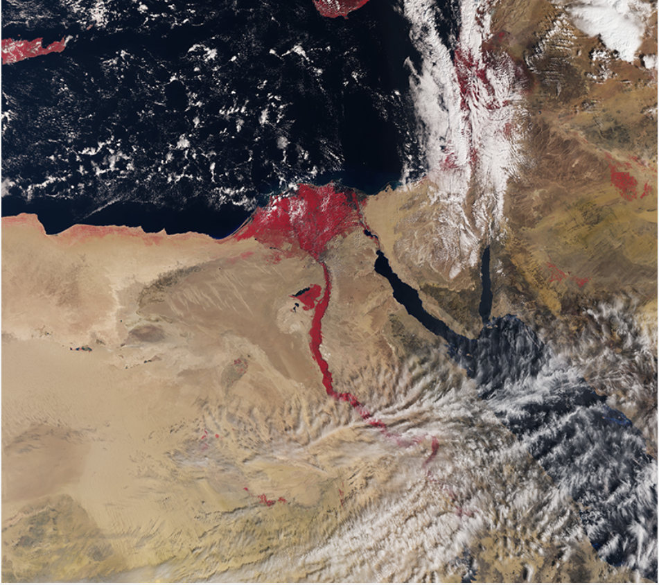
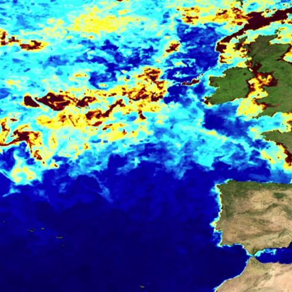
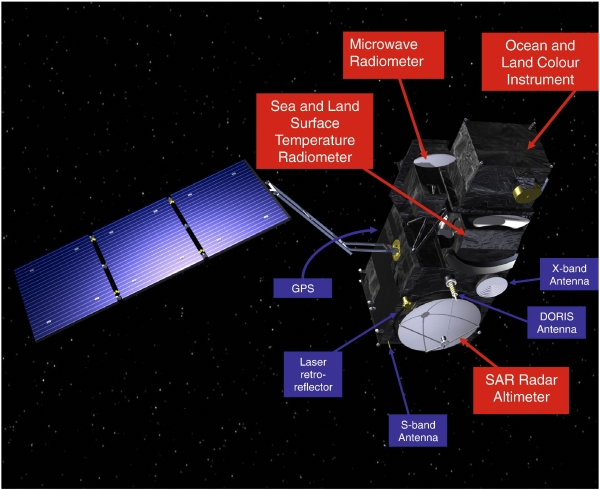
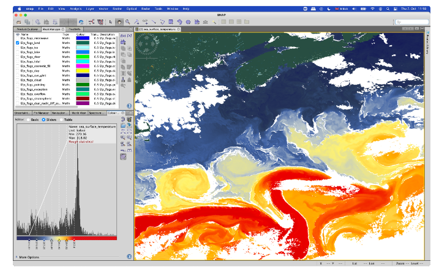
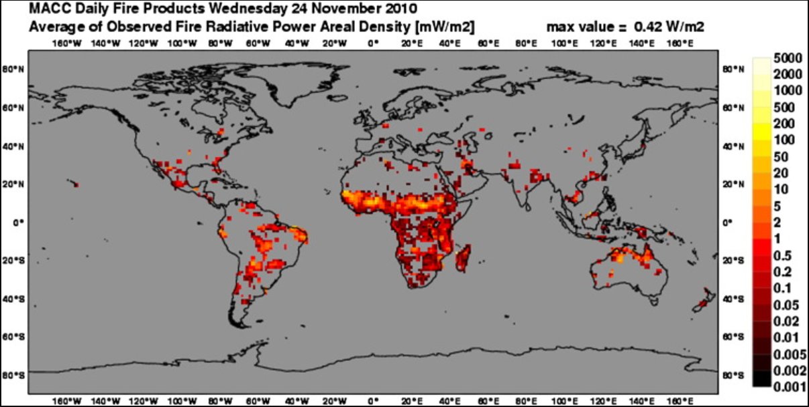

class: inverse, center, middle

```{r setup, include=FALSE}
library(RefManageR)
library(knitcitations)

options(htmltools.dir.version = FALSE)

# Citing Options
BibOptions(check.entries = FALSE,
           bib.style = "authoryear",
           cite.style = "authoryear",
           style = "markdown",
           hyperlink = TRUE,
           dashed = FALSE,
           no.print.fields=c("doi", "url", "urldate", "issn"))
myBib <- ReadBib("./references.bib", check = FALSE)

```
# Brief introduction to the SLSTR sensor
<div style="text-align:center">
    
    <p style="font-style:italic; color:gray;"></p>
</div>

`r Citet(myBib, 'slstr-sensor')`


---

# Introduction

Sea and Land Surface Temperature Radiometer (SLSTR) installed on the two Sentinel-3 series satellites (3A and 3B) – part of the European Union’s (EU) Copernicus Earth observation programme, aims to provide a reference Land Surface Temperature and Sea Surface Temperature dataset for climate data records.

| Sensor Type | Sensor Subtype | Altitude | Inclination |
|----------|----------|----------|----------|
| Spectrometers/Radiometers  | Radiometer   | 814.5km  | 98.65°  |


<div style="text-align:center">
    
    <p style="font-style:italic; color:gray;"> picture from SLSTR </p>
</div>

`r Citet(myBib, 'slstr-sensor-2')`

---

# Relative Datellites: Sentinel-3 

Main mission: ocean and land observation. 

(SLSTR is used for Multi-purpose VIS/IR imagery, with emphasis on very accurate surface temperature for climate)

Sentinel-3A and Sentinel-3B are operational, Sentinel-3C and Sentinel-3D are in planning. 

<div style="text-align:center">
    
    <p style="font-style:italic; color:gray;"> Sentinel-3 Satellite and Payloads </p>
</div>

`r Citet(myBib, 'sentinel-3-mission')`

---
# Products and Algorithms

Since the metadata obtained by SLSTR is very basic, additional algorithms are required to obtain the required products for study.

Processing of SLSTR products: 


|   | Level 0 | Level 1 | Level 2 |
|---|-------|-------|-------|
| Processing Overview | generates time sorted and annotated Level-0 data products from Instrument Source Packets (ISP) | derive a data product, in particular quality and classification flags as well as useful meteorological parameters | three core processors: WST/WCT and LST IPF, the FRP IPF, the AOD IPF. |
| Products Description | not available to users and is considered only as input to SLSTR Level-1 processing | provide products that have been calibrated and observed | five different product packages: results from the SST, the L2P, the LST, FRP and AOD processing |

`r Citet(myBib, 'sentinel3-slstr')`

---

# Applications: Climate and weather monitoring


<div style="text-align:center">
    
</div>

SLSTR support data to undertake independent research projects on cirrus clouds and the retrieval of sea surface temperatures. 

There are two SLSTR instruments in orbit currently, and together they are able to cover almost all the globe in a day. 

SLSTR makes measurements of both visible light and infrared (heat).  The infrared is used to derive surface temperatures, and the visible is used to help detect the clouds that obscure the surface and to retrieve aerosol and cloud properties. `r Citet(myBib, 'sentinel3-climate-weather')`


---

# Applications: Fire detection

<div style="text-align:center">
    
</div>

The flame radiation temperature is detected through SLSTR thermal channels by detecting the spectral radiation brightness in the special mid-infrared wavelength range emitted by open vegetation fires. 

The data is then processed using the SLSTR Active Fire algorithm, which uses a series of spatially varying thresholds to identify fire pixels.`r Citet(myBib, 'WOOSTER2012236')`


---

#Reflection

In recent years, with the gradual increase of extreme weather, some secondary disasters have followed, such as various forest fires and changes in ocean currents, and one of the obvious characteristics of these changes is the change in temperature. So I think this kind of timely, wide-reach temperature detection, while seemingly basic, may play an unexpectedly important role in disaster detection.

In addition, there are two satellites equipped with SLSTR that have not been launched in the entire plan, and I hope the sensor equipped with these two satellites can give us more surprises.

---

# References

```{r results='asis', echo=FALSE}


PrintBibliography(myBib)

```